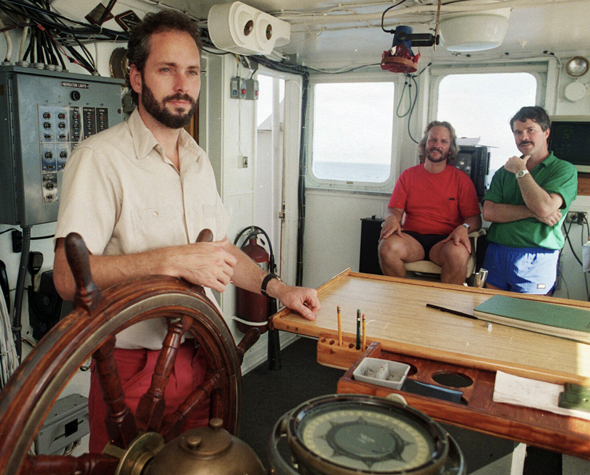
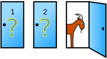
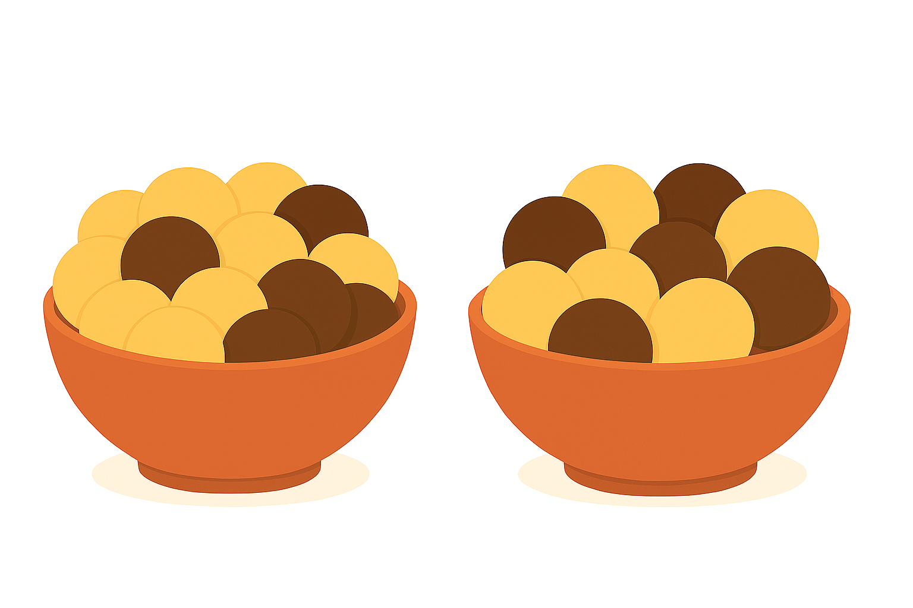

## Group Question 3
:::{style="font-size: .8em"}

```{python}
from IPython.core.display import HTML

def generate_html():
    return r"""
    <div class="blue-box">
        <p>
   Suppose \(\small X_1\) and \(\small X_2\) are independent random variables. \(\small X_1\) follows an exponential distribution with parameter \(\small \frac{1}{\theta}\). \( \small X_2\) is uniformly distributed on interval \(\small [0,\theta].\) \(\small \theta\) is unknown. Consider the following estimator for \(\small \theta:\)
    $$\small \hat{\theta} = \frac{1}{4}x_1 + \frac{3}{2}x_2.$$
    Here, \(x_1\) and \(x_2\) are realizations of \(X_1\) and \(X_2\), respectively.<br>
a. Compute the bias of \(\small \hat{\theta}.\)
    <br>
    <br>
    <br>
b. Is \(\small \hat{\theta}\) unbiased? Explain your answer.
    <br>
    <br>
    </div>
    """
html_content = generate_html()
display(HTML(html_content))
```

:::

## Group Question 3
:::{style="font-size: .8em"}

```{python}
from IPython.core.display import HTML

def generate_html():
    return r"""
    <div class="blue-box">
        <p>
c. Compute the variance of \(\small \hat{\theta}.\)
    <br>
    <br>
    <br>
    <br>
    <br>
d. Find the mean squared error of \(\small \hat{\theta}.\)
    <br>
    <br>
    <br>
    <br>
    <br>
    </div>
    """
html_content = generate_html()
display(HTML(html_content))
```

:::

## Finding the Ship of Gold
:::{style="font-size: .8em"}


:::{.columns}
::: {.column width="50%"}
:::{.center-text}

:::
:::
::: {.column width="50%"}

- **Official name:** SS Central America
- **Type:** 280‑foot (85 m) steamer
- **Service:** Operated between Central America and the U.S. East Coast during the 1850s
:::
:::
- **Fate:** Sank on September 12, 1857, with the loss of 425 lives and over 13 tons of gold. The precise location of the wreck was unknown to anyone until 1988.

:::

:::{.notes}
To motivate our discussion, I want to tell you a true story involving 

- a steamer on a stormy sea, 
- missing gold, 
- a group of scientists, 
- some truly awesome statistics, and even 
- imprisonment.

It never clicked how “wild” the Wild West was until I learned that the easiest way to travel from California to NYC and other major East Coast cities in 1850s America was 

- by ship down to Panama, 
- a short train ride, and 
- a steamer back up.

This is precisely why the SS Central America was sailing North in early September 1857.

Unfortunately, it encountered a powerful storm and sank on September 12.

The exact location of the wreck was not known to anybody until 1988. What was known were the weather reports and statements/testimonies from varios eyewitnesses of the event. 
:::

## Finding the Ship of Gold
:::{style="font-size: .8em"}
The ship was located by a group led by Thomas Gregory Thompson using Bayesian statistics.  

<!-- :::{.center-text}

::: -->

:::

:::{.notes}
That was enough for engineer Thomas Thompson to believe he could find the wreck. He assembled a diverse and talented team with expertise in robotics, sonar, and statistics.

They generated different scenarios for the location of the wreck, combined them, and then UPDATED them based on their findings at the location. 

Surprisingly, they found the wreck and the gold in a cell with low probability. Having low probability (not probable) /= impossible! 
:::

## Finding the Ship of Gold
:::{style="font-size: .8em"}
:::{.center-text}

:::

- **2000**: Thompson sold some of the recovered gold for $52 million.

- **2018**: He claimed he no longer had access to an additional 500 gold coins.

- **2015–2026**: Thompson was imprisoned from December 2015 to March 2026.
:::

:::{.notes}
Thompson’s team found and initially recovered substantial treasure from the SS Central America, but he and his organization became embroiled in multi-million dollar legal battles involving insurers, investors, and crew. His refusal to comply with court orders over the missing 500 coins led to arrests, convictions, and long-term jail time. 

With great power of Bayesian statistics, comes great responsibility!
:::


<!-- ## The Monty Hall Problem
:::{style="font-size: .8em"}
Let's consider a famously unintuitive problem in probability, the Monty Hall Problem. Many of you may have heard of this one.

:::{.center-text}

:::

What do you think, should we switch doors or stick with our original choice? Or does it make no difference?
:::

:::{.notes}
On his TV Show "Let's Make a Deal", Monty Hall would present contestants with three doors. Behind one was a prize, and behind the other two were gag gifts such as goats. The goal is to pick the door with the prize. After picking one of the three doors, Monty will open one of the other two doors revealing a gag prize, and then ask if you'd like to switch doors now.

Most people will say there's now a 50/50 chance the remaining doors have the prize, so it doesn't matter. 

But it turns out that's wrong! You actually have a 2/3 chance of finding the prize if you switch doors. 

Let's see why using a Bayes table.
:::  -->

## Learning Objectives
:::{style="font-size: .8em"}

- Basics of Bayesian statistics:
    - Prior
    - Likelihood
    - Posterior
    - Normalizing constant
- Bayesian update
- Bayes table
    - Python implementation
- Application to the cookie problem

:::

:::{.notes}
Bayesian - 2 types of pronounciation
:::

## The Cookie Problem
:::{style="font-size: .8em"}

Suppose there are two bowls of cookies.

- The first bowl: 30 vanilla cookies and 10 chocolate cookies.
- The second bowl: 20 vanilla cookies and 20 chocolate cookies.

:::{.center-text}

:::

__Question:__ If you choose a bowl at random, and then grab a cookie at random and get a vanilla cookie, what is the probability it came from the first bowl?

:::

## Review: Bayes' Rule
:::{style="font-size: .8em"}
```{python}
from IPython.core.display import HTML

def generate_html():
    return r"""
    <div class="purple-box">
     <span class="label">Bayes' Rule</span>
        <p>
        For any events \(\small{A}\) and \(\small{B}\) such that \(\small{P(B)>0,}\)  
        $$\small{P(A|B) = \frac{P(B|A)P(A)}{P(B)}}.$$
        </p>
    </div>
    """
html_content = generate_html()
display(HTML(html_content))
```
__Remark__: From the law of total probability it follows that, if we let $\small{A_1, \dots, A_n}$ be events where $\small{A_i}$'s are disjoint and form the entire sample space, then 
$$\small{P(A_i|B) = \frac{P(B|A_i)P(A_i)}{\Sigma_j P(B|A_j)P(A_j)}.}$$ 
:::

## The Cookie Problem
:::{style="font-size: .8em"}
Since the first bowl contains more vanilla cookies, we anticipate that the cookie is more likely to come from the first bowl than the second one.

Let's define the following events:

- $\small{B_i}$ representing that bowl $i$ was selected
- $\small{V}$ representing that the cookie is vanilla

Then the probability we are looking for is $\small P(B_1 \vert V).$

Using Bayes' rule we obtain:

$$\small P(B_1 \vert V) = \frac{P(V \vert B_1)\;P(B_1)}{P(V)}.$$
:::

## The Cookie Problem
:::{style="font-size: .8em"}

From the problem description we know that

- $\small P(B_1) = \frac{1}{2}$ because one of the two bowls was selected randomly 
- $\small P(V \vert B_1) = \frac{30}{40} = \frac{3}{4}$ because bowl 1 contains 40 cookies 30 of which are vanilla.

We use the law of total probability to find $\small P(V):$

$$\small \begin{align*}
 P(V)  & = P(V \vert B_1)\;P(B_1) +  P(V \vert B_2)\;P(B_2) 
= \frac{3}{4}\cdot \frac{1}{2}+\frac{1}{2}\cdot \frac{1}{2} = \frac{5}{8}.
\end{align*}$$

```{python}
from IPython.core.display import HTML

def generate_html():
    return r"""
    <div class="blue-box">
        <p>
   Is there a different way to find \(\small P(V)?\)
    </div>
    """
html_content = generate_html()
display(HTML(html_content))
```

:::

<!-- ## The Cookie Problem
:::{style="font-size: .8em"}
Let's put it all together now:

$$\small \begin{align*}
P(\text{first bowl} \vert \text{vanilla cookie})\ & = \frac{P(\text{vanilla cookie} \vert \text{first bowl})P(\text{first bowl})}{P(\text{vanilla cookie})}\\
& = \frac{(3/4)(1/2)}{5/8} = 3/5.
\end{align*}$$

<br><br>

Just like we suspected, because the first bowl had more vanilla cookies, it was more likely that our cookie came from the first bowl.
::: -->

## The Cookie Problem
:::{style="font-size: .8em"}

We conclude that

$$\small P(B_1 \vert V) = \frac{P(V \vert B_1)\;P(B_1)}{P(V)} = \frac{(3/4)(1/2)}{(5/8)} =\frac{3}{5}.$$

Hence, the probability that the cookie came from bowl 2 is 
$$\small 1- \frac{3}{5} = \frac{2}{5},$$ 
which is indeed lower than $\frac{3}{5}.$


In Bayesian statistics, we refer to $\small B_1$ as a **hypothesis** and to $\small V$ as the **data**.

__Notation__: Typically, we denote a hypothesis by $\small H$, and the data by $\small D$. 

We can use this to rewrite the Bayes’ rule as follows. 


:::

## Basic Bayesian Concepts
:::{style="font-size: .8em"}

```{python}
from IPython.core.display import HTML

def generate_html():
    return r"""
    <div class="purple-box">
     <span class="label">Bayes' Rule</span>
        <p> For a hypothesis \(\small{H}\) and some data \(\small{D}\) such that \(\small P(D)>0\),

        $$\small P(H \,\vert\, D)\; =  \frac{P(H)P(D\,\vert\,H) \; }{P(D)}. $$
        </p>
    </div>
    """
html_content = generate_html()
display(HTML(html_content))
``` 
- **Prior**: the probability of the hypothesis before observing the data, $\small P(H)$
- **Posterior**: the probability of the hypothesis after observing the data, $\small P(H \vert D)$
- **Likelihood**: the probability of the data given the hypothesis, $\small  P(D \vert H)$
- **Total probability of the data** (or **normalizing constant**): the overall probability of the data under all possible hypotheses, $\small P(D)$

<!-- 

- $P(H)$ is the probability of the hypothesis before we see the data, called the **prior** probability.
- $P(H \vert D)$ is the probability of the hypothesis after we see the data, called the **posterior** probability.
- $P(D \vert H)$ is the probability of the data under the hypothesis, called the **likelihood**.
- $P(D)$ is the **total probability of the data** under any hypothesis (it is also known as the **normalizing constant**). -->


:::

## Prior and Likelihood
:::{style="font-size: .8em"}

_**Prior**_:<br>
Often the most subjective part of Bayes’ rule. In some cases it can be computed directly (e.g., equal likelihood of choosing each bowl), while in others it depends on modeling assumptions (e.g., selection proportional to bowl size or relevant background information).<br><br>
_**Likelihood**_:<br>
Usually well defined and straightforward to compute. When the data‑generating process is known (as in the cookie bowl problem), probabilities under each hypothesis can be calculated directly.

<!-- The _**prior**_ is often the most challenging component of Bayes’ rule to specify. In some cases, it can be determined exactly—for example, in the cookie bowl problem, where each bowl is selected with equal probability. In other situations, additional assumptions must be incorporated, such as selecting bowls in proportion to their size. More generally, the choice of prior may depend on which background information is deemed relevant, and reasonable individuals may disagree on this point.<br><br>
The _**likelihood**_, by contrast, is typically well defined and can be computed directly. In the cookie problem, the composition of each bowl is known, allowing us to calculate the probability of the observed data under each hypothesis. -->

:::

## Total Probability
:::{style="font-size: .8em"}


_**Total probability of the data**_:<br>
Determining the total probability of the data can be more difficult than it first appears, since we may not know or be able to enumerate all possible hypotheses. <br>
In practice, we typically restrict attention to a set of **disjoint** (or **mutually exclusive**) and **collectively exhaustive** hypotheses, meaning that exactly one hypothesis is true and all possibilities are accounted for.

Then, just as before, we can use the law of total probability

$$\small P(D) = \sum_j{P(H_j)P(D \vert H_j)}. $$


:::

## Bayes Table
:::{style="font-size: .8em"}

```{python}
from IPython.core.display import HTML

def generate_html():
    return r"""
    <div class="purple-box">
     <span class="label">Bayesian Update</span>
        <p>
         A Bayesian update is the process of generating a posterior probability from a prior probability using data.
        </p>
    </div>
    """
html_content = generate_html()
display(HTML(html_content))
``` 

<br>
A Bayes table is a structured approach to keep track of these updates. 

```{python}
from IPython.core.display import HTML

def generate_html():
    return r"""
    <div class="purple-box">
     <span class="label">Bayes Table</span>
        <p> 
         A Bayes table is a table that keeps track of the probabilities of all hypotheses as we update them using our data.
        </p>
    </div>
    """
html_content = generate_html()
display(HTML(html_content))
``` 
:::

## Bayes Table
:::{style="font-size: .8em"}
To build a Bayes table for the cookie problem, we start by listing all possible hypotheses, one per row. <br><br>

```{python}
#| echo: true
import pandas as pd

table = pd.DataFrame()
table['hypothesis'] = ['first bowl', 'second bowl']
```

```{python}
#| echo: false
table.style.hide(axis="index")
```

```{python}
from IPython.core.display import HTML

def generate_html():
    return r"""
    <div class="blue-box">
        <p>
   What values should we enter in the prior column?
    </div>
    """
html_content = generate_html()
display(HTML(html_content))
```

:::

## Bayes Table
:::{style="font-size: .8em"}

The likelihood of each hypothesis is the fraction of cookies in each bowl that is vanilla.  

```{python}
#| echo: true
table['prior'] = 1/2, 1/2
table['likelihood'] = 30/40, 20/40
```

```{python}
#| echo: false
table.style.format({"prior": "{:.2f}", "likelihood": "{:.2f}"}).hide(axis="index")
```

It remains to perform the Bayesian update. We do this in three steps:

1. Compute the **unnormalized posterior**
2. Compute the total probability of the data
3. Compute the posterior
:::

## Bayes Table
:::{style="font-size: .8em"}

The unnormalized posterior is computed by multiplying the prior and likelihood columns entrywise.

```{python}
#| echo: true
table['unnorm. post.'] = table['prior'] * table['likelihood']
```
```{python}
# | echo: false 
table.style.format({"prior": "{:.2f}", "likelihood": "{:.2f}", "unnorm. post.": "{:.3f}"}).hide(axis="index")
```

We obtain the total probability of the data by summing the unnormalized posteriors.
<!-- The final step is normalization: divide by the total probability of the data, which we obtain by summing the unnormalized posteriors. -->
```{python}
#| echo: true
prob_data = table['unnorm. post.'].sum()
prob_data
```

This gives us 5/8, just like we calculated before. 

:::

<!-- ## Bayes Table
:::{style="font-size: .8em"}
The final missing piece is to divide by the total probability of the data. 

What we are doing is _**normalizing**_ the posteriors so that they sum up to 1.

To find the total probability of the data we directly sum over the unnormalized posteriors:

```{python}
#| echo: true
prob_data = table['unnorm. post.'].sum()
prob_data
```

This gives us 5/8, just like we calculated before. 
::: -->

## Bayes Table
:::{style="font-size: .8em"}

The final step is normalization: divide the entries in the unnormalized posterior column by the total probability of the data.

<!-- Finally, we can use the total probability of the data to get the posterior probability of each hypothesis. -->

```{python}
#| echo: true
table['posterior'] = table['unnorm. post.'] / prob_data
```

```{python}
# | echo: false 
table.style.format({"prior": "{:.2f}", "likelihood": "{:.2f}", "unnorm. post.": "{:.3f}", "posterior": "{:.2f}"}).hide(axis="index")
```

The posterior probability of the first bowl given a vanilla cookie is $0.6 = \frac{3}{5}$, consistent with the earlier Bayes’ theorem calculation. 

Note that both the prior and the posterior are _**distributions**_! The entries of each of these columns are probabilities and sum to 1. 
<!-- As expected for mutually exclusive and exhaustive hypotheses, the posteriors sum to 1. -->

:::

## Bayes Table
:::{style="font-size: .8em"}
We introduce an update function to simplify subsequent computations.

```{python}
#| echo: true
def update(table):
    table['unnorm. post.'] = table['prior'] * table['likelihood']
    prob_data = table['unnorm. post.'].sum()
    table['posterior'] = table['unnorm. post.'] / prob_data
    return table

table = pd.DataFrame()
table['hypothesis'] = ['first bowl', 'second bowl']
table['prior'] = 1/2, 1/2,
table['likelihood'] = 3/4, 1/2

update(table)
table.style.format({"prior": "{:.2f}", "likelihood": "{:.2f}", "unnorm. post.": "{:.3f}", "posterior": "{:.2f}"}).hide(axis="index")
```


:::

<!-- ## The Monty Hall Problem
:::{style="font-size: .8em"}
Now let's return to the Monty Hall Problem. 

:::{.center-text}

:::

What do you think, should we switch doors or stick with our original choice? Or does it make no difference?
:::


## The Monty Hall Problem
:::{style="font-size: .8em"}

Each door starts with an equal prior probability of holding the prize:
```{python}
#| echo: true
table = pd.DataFrame(index=['Door 1', 'Door 2', 'Door 3'])
table['prior'] = 1/3, 1/3, 1/3
table
```

What is our _**data**_ in this scenario? 

Without loss of generality, suppose we originally picked door 1. Now Monty opens a door (let's say door 3, again without loss of generality) to reveal a gag prize. So the door that is open gives us the data.

What are the _**hypotheses**_? And what is the _**likelihood**_ of the data under each hypothesis? 
:::

## The Monty Hall Problem
:::{style="font-size: .8em"}

__**Hypothesis 1:**__ The prize is behind door 1

In this case Monty chose door 2 or door 3 at random, so he was equally likely to open door 2 and 3, so the observation that he opened door 3 had a 50/50 chance of occurring.

__**Hypothesis 2:**__ The prize is behind door 2

In this case Monty _**must**_ open door 3, so the observation that he opened door 3 was guaranteed to happen.

__**Hypothesis 3:**__ The prize is behind door 3

Monty could not have opened a door with the prize behind it, so the probability of seeing him open door 3 under this hypothesis is 0.

:::

## The Monty Hall Problem
:::{style="font-size: .7em"}

```{python}
#| echo: true
table['likelihood'] = 1/2, 1, 0
table
```

Now let's find the posterior probabilities using the update function. 

```{python}
#| echo: true
update(table)
```

Turns out there is a 2/3 probability the prize is behind door 2! We should switch doors.
::: -->


<!-- ## Prior and Posterior Distributions
:::{style="font-size: .8em"}

The set of _**prior probabilities**_ are in reality a _**prior distribution**_. Likewise, the set of _**posterior probabilities**_ are in reality a _**posterior distribution**_ across hypotheses. 

Let's reformulate the cookie problem using distributions.

We will use a uniform probability distribution as a prior (a "**uniform prior**"):

```{python}
import numpy as np
```

```{python}
#| echo: true
from scipy.stats import randint
distribution = pd.DataFrame(index=['first bowl', 'second bowl'])
#uniform prior distribution
distribution['probs'] = randint(1, 3).pmf(np.arange(1,3)) 
distribution
```

:::

## Prior and Posterior Distributions
:::{style="font-size: .8em"}


:::{.center-text}
```{python}
import matplotlib.pyplot as plt
fig, ax = plt.subplots()
distribution.plot(kind = 'bar', ax = ax, ylim = [0, 1], legend = False, ylabel = 'Probability', fontsize = 16)
plt.xticks(rotation='horizontal')
ax.yaxis.label.set_fontsize(16)
plt.title('Prior Distribution (Uniform Prior)', size = 16);
```
:::
:::

## Prior and Posterior Distributions
:::{style="font-size: .8em"}
Now let's introduce an update function like before, but this time it updates our probability distribution based on likelihoods.

```{python}
#| echo: true
def update(distribution, likelihood):
    '''perform a Bayesian update on distribution using likelihood'''
    distribution['probs'] = distribution['probs'] * likelihood
    prob_data = distribution['probs'].sum()
    distribution['probs'] = distribution['probs'] / prob_data
    return distribution
```
Let's use it to compute the posterior probabilities.

```{python}
#| echo: true
likelihood_vanilla = [0.75, 0.5]
update(distribution, likelihood_vanilla)
```

:::

## Prior and Posterior Distributions
:::{style="font-size: .8em"}
:::{.center-text}
```{python}
old_posterior = distribution.copy()
fig, ax = plt.subplots()
distribution.plot(kind = 'bar', ax = ax, ylim = [0, 1], legend = False, ylabel = 'Probability', fontsize = 16)
plt.xticks(rotation='horizontal')
ax.yaxis.label.set_fontsize(16)
plt.title('Posterior Distribution', size = 16);
```
:::
::: -->


<!-- ## Group Question 1
:::{style="font-size: .8em"}

```{python}
from IPython.core.display import HTML

def generate_html():
    return r"""
    <div class="blue-box">
        <p>
Red howler monkeys eat a variety of foods. Holly’s favorite is figs. For her birthday, researchers prepared three food boxes.
</p>

        <ul>
           
            <li><strong>Box 1:</strong> 40% leaves, 25% figs, 10% plums, remainder buds and flowers</li>
            <li><strong>Box 2:</strong> 10% leaves, 45% figs, 25% plums, remainder buds and flowers</li>
            <li><strong>Box 3:</strong> 50% leaves, 15% figs, 15% plums, remainder buds and flowers</li>

        </ul>

        <p>
Holly selects a box at random and then a treat at random. The selected treat is a fig.<br>

a. Define the relevant hypotheses and state their prior probabilities.
    <br>
    <br>
    """
html_content = generate_html()
display(HTML(html_content))
```
::: -->

## Group Question 1
:::{.columns}
::: {.column width="45%"}
<!-- :::{.center-text}

::: -->
:::
::: {.column width="55%"}
:::{style="font-size: .7em"}


```{python}
from IPython.core.display import HTML

def generate_html():
    return r"""
<div class="blue-box">
        <p>
Red howler monkeys eat a variety of foods. Holly’s favorite is figs. For her birthday, researchers prepared three food boxes.
</p>
     <p><l start="*">
        <ul>
           
            <li><strong>Box 1:</strong> 40% leaves, 25% figs, 10% plums, remainder buds and flowers</li>
            <li><strong>Box 2:</strong> 10% leaves, 45% figs, 25% plums, remainder buds and flowers</li>
            <li><strong>Box 3:</strong> 50% leaves, 15% figs, 15% plums, remainder buds and flowers</li>

        </ul>
</p>
    </div>
    """
html_content = generate_html()
display(HTML(html_content))
```
:::
:::
:::
:::{style="font-size: .7em"}
```{python}
from IPython.core.display import HTML

def generate_html():
    return r"""
    <div class="blue-box">
        <p>
Holly selects a box at random and then a treat at random. The selected treat is a fig.<br>

a. Define the relevant hypotheses and state their prior probabilities.
    <br>
</p>
    </div>
    """
html_content = generate_html()
display(HTML(html_content))
```
:::

## Group Question 1
:::{style="font-size: .8em"}

```{python}
from IPython.core.display import HTML

def generate_html():
    return r"""
    <div class="blue-box">
        <p>
b. Determine the likelihood of observing a fig under each hypothesis.
    <br>
    <br>
    <br>
    <br>
c. Construct a Bayes table and use it to compute the posterior probability that the fig came from each box.
    <br>
    <br>
    <br>
    <br>
    <br>
    <br>
    <br>
    </div>
    """
html_content = generate_html()
display(HTML(html_content))
```
:::


<!-- ## Finding the Ship of Gold
:::{style="font-size: .8em"}


:::{.columns}
::: {.column width="50%"}
:::{.center-text}

:::
:::
::: {.column width="50%"}

- **Official name:** SS Central America
- **Type:** 280‑foot (85 m) steamer
- **Service:** Operated between Central America and the U.S. East Coast during the 1850s
:::
:::
- **Fate:** Sank on September 12, 1857, with the loss of 425 lives and over 13 tons of gold. The precise location of the wreck was unknown to anyone until 1988.

::: -->


<!-- ## Group Question 2
:::{style="font-size: .8em"}

```{python}
from IPython.core.display import HTML

def generate_html():
    return r"""
    <div class="blue-box">
        <p>
   Suppose we have a box with a 6-sided die, an 8-sided die, and a 12-sided die. We choose one of the dice at random, roll it, and report that the outcome is a 1. Make a Bayes table to compute the probability that we chose the 6-sided die.
    <br>
    <br>
    <br>
    <br>
    <br>
    <br>
    <br>
    <br>
    <br>
    </div>
    """
html_content = generate_html()
display(HTML(html_content))
```
::: -->