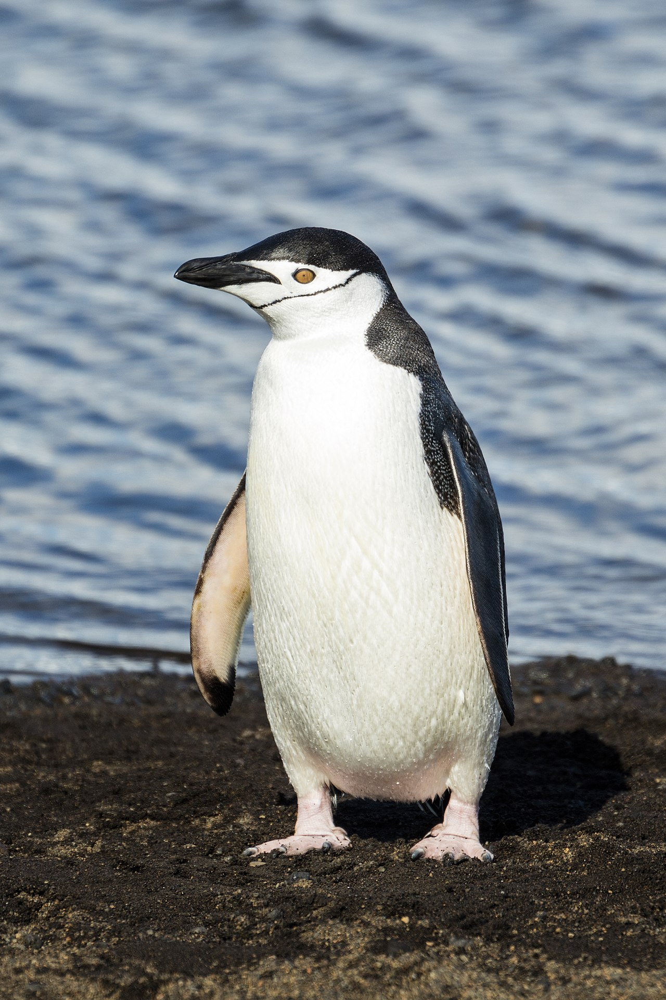

```{python}
#| echo: false
import pandas as pd
import numpy as np
import matplotlib.pyplot as plt
import seaborn as sns
from scipy.stats import norm, multivariate_normal

def update(distribution, likelihood):
    '''Standard Bayesian update function'''
    distribution['probs'] = distribution['probs'] * likelihood
    prob_data = distribution['probs'].sum()
    distribution['probs'] = distribution['probs'] / prob_data
    return distribution

```

## Spam Detection

:::{style="font-size: .8em"}
:::{.center-text}

:::

- Naive Bayes classifies emails by estimating how likely they are to be spam. 
- It relies on a bag‑of‑words representation, treating each email as a collection of independent words.
- It has above 95% accuracy.
:::

## Learning Objectives
:::{style="font-size: .8em"}

- Naive Bayes
    - The "naive" assumption
- Empirical Bayes
    - Controversy
- Application to the penguin-classification problem

:::


## Penguin Classification

:::{style="font-size: .8em"}

A dataset on 344 penguins contains information on 

- Penguin type: Adélie, Chinstrap, and Gentoo
- Flipper length 
- Culmen (beak) length

<br>


```{python}
# Load the Palmer Penguins dataset
# You can install with: pip install palmerpenguins
try:
    from palmerpenguins import load_penguins
    df = load_penguins()
    # Rename columns to match our convention
    df = df.rename(columns={
        'flipper_length_mm': 'Flipper Length (mm)',
        'bill_length_mm': 'Culmen Length (mm)',
        'species': 'Species'
    })
    df['Species'] = df['Species'].str.capitalize()
except ImportError:
    # Fallback: load from local CSV if palmerpenguins not installed
    df = pd.read_csv('images/classification/penguins.csv')
    df['Species'] = df['Species'].str.split(' ').str[0]

# Show first few rows
df[['Species', 'Flipper Length (mm)', 'Culmen Length (mm)']].head(3)
```

:::

## Penguin Classification

:::{style="font-size: .8em"}

__Question__: Classify a penguin with a flipper length of 193 mm and a culmen length of 48 mm as Adélie, Chinstrap, or Gentoo using Naive Bayes.

<br>

::: {.columns}
::: {.column width="33%"}
{width=200}
:::
::: {.column width="33%"}
{width=200}
:::
::: {.column width="33%"}
{width=200}
:::
:::

:::

## Visualizing the Data

:::{style="font-size: .8em"}

```{python}
#| echo: false
#| fig-align: center

fig, axes = plt.subplots(1, 2, figsize=(12, 4.5))

# Flipper length by species
for species in df['Species'].unique():
    data = df[df['Species'] == species]['Flipper Length (mm)'].dropna()
    axes[0].hist(data, alpha=0.6, label=species, bins=15)
axes[0].set_xlabel('Flipper Length (mm)', size=18)
axes[0].set_ylabel('Count', size=18)
# axes[0].set_title('Flipper Length by Species', size=14)
axes[0].legend(fontsize=14)
axes[0].tick_params(axis='both', labelsize=14)

# Culmen length by species
for species in df['Species'].unique():
    data = df[df['Species'] == species]['Culmen Length (mm)'].dropna()
    axes[1].hist(data, alpha=0.6, label=species, bins=15)
axes[1].set_xlabel('Culmen Length (mm)', size=18)
axes[1].set_ylabel('Count', size=18)
# axes[1].set_title('Culmen Length by Species', size=14)
axes[1].legend(fontsize=14)
axes[1].tick_params(axis='both', labelsize=14)
# plt.legend(fontsize=14)

plt.tight_layout()
plt.show()
```
<span style="color:rgb(1, 180, 180);">What do we observe about this dataset?</span>
:::

## The Bayesian Approach

:::{style="font-size: .8em"}


1. **Hypothesis:** Use the three types of penguins as the hypotheses.

2. **Prior:** What do we believe before seeing any data?
   - P(Adélie), P(Chinstrap), P(Gentoo)


3. **Likelihood:** How likely is the observed data under each hypothesis?
   - P(flipper length = 193 mm | Adélie)
   - P(culmen length = 48 mm | Chinstrap)
   - etc.


4. **Posterior:** Update beliefs using Bayes' theorem.
   - P(Adélie | data), P(Chinstrap | data), P(Gentoo | data)


5. **Decision:** Use the MAP estimate for the type.

:::

##  Prior

:::{style="font-size: .8em"}

Without any measurements, all species are equally likely.

```{python}
# Create prior distribution
species_list = df['Species'].unique()
prior = pd.DataFrame(species_list, columns=['Species'])
prior['probs'] = 1/len(species_list)
prior
```
<br>
```{python}
from IPython.core.display import HTML

def generate_html():
    return r"""
    <div class="blue-box">
        <p>
   When might we want a non-uniform prior?
    </div>
    """
html_content = generate_html()
display(HTML(html_content))
```

:::

## Likelihood

:::{style="font-size: .8em"}
- Assume that both flipper length and culmen length are normally distributed
- Consider each feature separately
- Estimate parameters from data:
    - $\mu$ is the sample mean 
    - $\sigma^2$ is the sample variance

:::{.center-text}
<table style="border-collapse: collapse; margin: 10px 0;">
  <tr style="border-bottom: 2px solid black;">
    <th style="padding: 5px 15px; text-align: left;">Species</th>
    <th style="padding: 5px 15px; text-align: center;">Flipper Distribution</th>
    <th style="padding: 5px 15px; text-align: center;">Culmen Distribution</th>
  </tr>
  <tr>
    <td style="padding: 5px 15px;"><b>Adélie</b></td>
    <td style="padding: 5px 15px; text-align: center;">N(μ=190.0, σ²=6.5²)</td>
    <td style="padding: 5px 15px; text-align: center;">N(μ=38.8, σ²=2.7²)</td>
  </tr>
  <tr>
    <td style="padding: 5px 15px;"><b>Gentoo</b></td>
    <td style="padding: 5px 15px; text-align: center;">N(μ=217.2, σ²=6.5²)</td>
    <td style="padding: 5px 15px; text-align: center;">N(μ=47.5, σ²=3.1²)</td>
  </tr>
  <tr>
    <td style="padding: 5px 15px;"><b>Chinstrap</b></td>
    <td style="padding: 5px 15px; text-align: center;">N(μ=195.8, σ²=7.1²)</td>
    <td style="padding: 5px 15px; text-align: center;">N(μ=48.8, σ²=3.3²)</td>
  </tr>
</table>
:::

:::


## Likelihood

:::{style="font-size: .8em"}

The normal distributions for flipper length allow us to evaluate how likely the observed value of 193 mm is under each species.
```{python}
def make_norm_map(df, colname, by='Species'):
    """Create normal distribution for each species based on data."""
    norm_map = {}
    grouped = df.groupby(by)[colname]
    for species, group in grouped:
        mean = group.mean()
        std = group.std()
        norm_map[species] = norm(mean, std)
    return norm_map

# Create distributions for flipper length
flipper_map = make_norm_map(df, 'Flipper Length (mm)')
```

```{python}
#| fig-width: 10
#| fig-height: 4
#| fig-align: center

x = np.linspace(170, 240, 300)
plt.figure(figsize=(10, 5))

for species in flipper_map.keys():
    y = flipper_map[species].pdf(x)
    plt.plot(x, y, label=species, linewidth=2)

plt.axvline(x=193, color='black', linestyle='--', linewidth=2, label='Data')

plt.xlabel('Flipper Length (mm)', size=18)
plt.ylabel('Likelihood (PDF)', size=18)
# plt.title('Flipper Length Distributions by Species', size=14)
plt.xticks(fontsize=14)
plt.yticks(fontsize=14)
plt.legend(fontsize=14)
plt.grid(alpha=0.3)
plt.show()
```
:::

## Likelihood

:::{style="font-size: .8em"}

**Observation:** Flipper length = 193 mm

```{python}
observed_flipper = 193

# Calculate likelihood for each species
likelihood = [flipper_map[species].pdf(observed_flipper)
              for species in species_list]

likelihood_df = pd.DataFrame({
    'Species': species_list,
    'Likelihood': likelihood
})
likelihood_df
```


Adélie and Chinstrap are most likely, Gentoo is very unlikely!

```{python}
from IPython.core.display import HTML

def generate_html():
    return r"""
    <div class="blue-box">
        <p>
   How can we incorporate this information with the culmen‑length observation?
    </div>
    """
html_content = generate_html()
display(HTML(html_content))
```


:::

## Bayesian Update

:::{style="font-size: .8em"}
Apply Bayes' theorem to get the posterior:

$$P(\text{Species} \mid \text{Data}) = \frac{ P(\text{Species}) \cdot P(\text{Data} \mid \text{Species}) }{P(\text{Data})}$$

```{python}
# Create comprehensive update table
update_table = pd.DataFrame({
    'Species': species_list,
    'Prior': prior['probs'].values,
    'Likelihood': likelihood,
})

# Calculate unnormalized posterior
update_table['Unnorm. Posterior'] = update_table['Prior'] * update_table['Likelihood']

# Normalize to get posterior
normalizer = update_table['Unnorm. Posterior'].sum()
update_table['Posterior'] = update_table['Unnorm. Posterior'] / normalizer

update_table
```
<br>
Flipper length alone doesn't distinguish Adélie from Chinstrap well.
:::

## Bayesian Update

:::{style="font-size: .8em"}

Let's include  the culmen length.

_**Key idea:**_ The posterior becomes the prior for the second update!
<br><br>
```{python}
# Create distributions for culmen length
culmen_map = make_norm_map(df, 'Culmen Length (mm)')

# Observed culmen length
observed_culmen = 48

# Calculate likelihood for culmen length
likelihood_culmen = [culmen_map[species].pdf(observed_culmen)
                     for species in species_list]

# Create comprehensive update table
# The "Prior" here is actually the posterior from flipper length!
update_table_2 = pd.DataFrame({
    'Species': species_list,
    'Prior (from flipper)': update_table['Posterior'].values,
    'Likelihood (culmen)': likelihood_culmen,
})

# Calculate unnormalized posterior
update_table_2['Unnorm. Posterior'] = update_table_2['Prior (from flipper)'] * update_table_2['Likelihood (culmen)']

# Normalize to get posterior
normalizer = update_table_2['Unnorm. Posterior'].sum()
update_table_2['Posterior'] = update_table_2['Unnorm. Posterior'] / normalizer

update_table_2
```
<br>

The _**MAP estimate**_: the new penguin is a Chinstrap! 

:::

## The "Naive" Assumption

:::{style="font-size: .8em"}

We just used two features _**separately**_:

1. Updated based on flipper length
2. Updated based on culmen length


_**This assumes:**_ Flipper length and culmen length are _**independent**_ 

<!-- $$P(\text{Flipper}, \text{Culmen} \mid \text{Species}) = P(\text{Flipper} \mid \text{Species}) \cdot P(\text{Culmen} \mid \text{Species})$$ -->


_**Is this true?**_

Probably not: larger penguins likely have both longer flippers and longer beaks.

<br>

_**What happens if we don't make this assumption?**_


:::

## Less "Naive" Bayes

:::{style="font-size: .8em"}
The independence assumption can be avoided by using the multivariate normal distribution (outside the scope of this class). However, the result remains approximately the same.

- Naive Bayes accuracy: _**94.7%**_
- Multivariate Normal accuracy: _**95.3%**_

_**Conclusion**_: Multivariate normal computation is considerably more involved, but it offers only a slight improvement in accuracy.
:::

## Empirical Bayes

:::{style="font-size: .8em"}

Instead of a uniform prior, we could use the data itself to construct an informative prior. 

```{python}
#| echo: false
species_counts = df['Species'].value_counts()
species_proportions = species_counts / species_counts.sum()
```
<br>

<!-- **Empirical Bayes approach:** Use these proportions as priors -->

```{python}
# Create empirical prior
prior_empirical = pd.DataFrame(species_list, columns=['Species'])
prior_empirical['probs'] = [species_proportions[sp] for sp in species_list]
prior_empirical
```
<br>
This approach is known as **Empirical Bayes.**

_**The controversy:**_ The same data is used to set the prior and the likelihood.

:::

## Group Question 1
:::{style="font-size: .8em"}

```{python}
from IPython.core.display import HTML

def generate_html():
    return r"""
    <div class="blue-box">
        <p>
You are building an email classifier to distinguish between work emails and personal emails based on word usage. The classifier focuses only on words included in the email. You've analyzed your inbox and found:

 <p><l start="*">
        <ul>
           
            <li>60% of emails are work-related, 40% are personal </li>
 <li> The word "meeting" appears in 50% of work emails and 10% of personal emails </li>
<li> The word "urgent" appears in 30% of work emails and 5% of personal emails </li>
<li> The word "dinner" appears in 20% of personal emails and 5% of work emails
</li>

        </ul>
</p>

    </div>
    """
html_content = generate_html()
display(HTML(html_content))
```
:::


## Group Question 1
:::{style="font-size: .8em"}

```{python}
from IPython.core.display import HTML

def generate_html():
    return r"""
    <div class="blue-box">
        <p>
You receive an email containing the words "meeting" and "dinner." Using Naive Bayes, compute the posterior probability that this is a work email.
  <br><br><br>
    <br><br><br>
      <br><br><br>
         <br>
    </div>
    """
html_content = generate_html()
display(HTML(html_content))
```
:::
