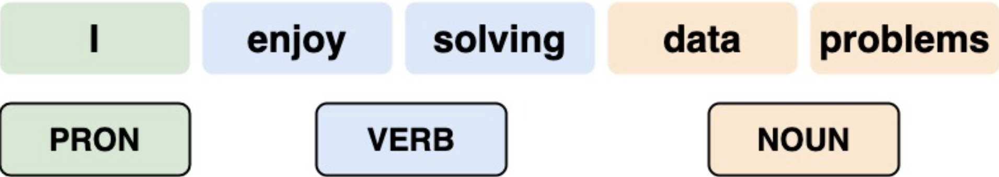

## What Have We Talked About?
:::{style="font-size: .75em"}

 - The fundamentals of probability
 - The difference between frequentist and Bayesian points of view on probability and statistics
 - Markov chains and hidden Markov models
 - The use of statistics in the real world

:::{.columns}

::: {.column width="50%"}

:::{.center-text}

:::

:::

::: {.column width="50%"}

:::{.center-text}

:::

:::
:::

:::

## Real-Life Applications
:::{style="font-size: .8em"}
:::{.center-text}

:::

:::

## Practice Makes It Click
:::{style="font-size: .8em"}

:::{.columns}
::: {.column width="40%"}

We strengthened our understanding by solving problems 

- throughout the lecture 
- as group questions
- in homework assignments
- during discussions

:::
::: {.column width="60%"}

:::{.center-text}

:::

:::
:::

:::

## Considered Problems
:::{style="font-size: .8em"}

:::{.columns}
::: {.column width="30%"}

:::{.center-text}

:::

:::
::: {.column width="70%"}

1. How can we determine whether one soccer team is significantly better than another?

:::
:::

:::{.columns}

:::
::: {.column width="70%"}

2. How did a group of MIT students crack the Massachusetts State Lottery?
:::

::: {.column width="30%"}

:::{.center-text}

:::

:::

:::

## Considered Problems
:::{style="font-size: .8em"}

3. How can we accurately assign word classes to a body of text?

:::{.center-text}

::: 

4. How can we estimate the total number of episodes in a show after watching just one?

:::{.center-text}

::: 

:::

## Course Evaluations
:::{style="font-size: .8em"}

Please submit your course evaluations:

- For Prof. Wobbes, CDS DS 122 A1 - Foundations of Data Science 3

- For Yuke Zhang, CDS DS 122 A3/A4/A5 - Foundations of Data Science 3

 
Your feedback is valuable to us!
:::
